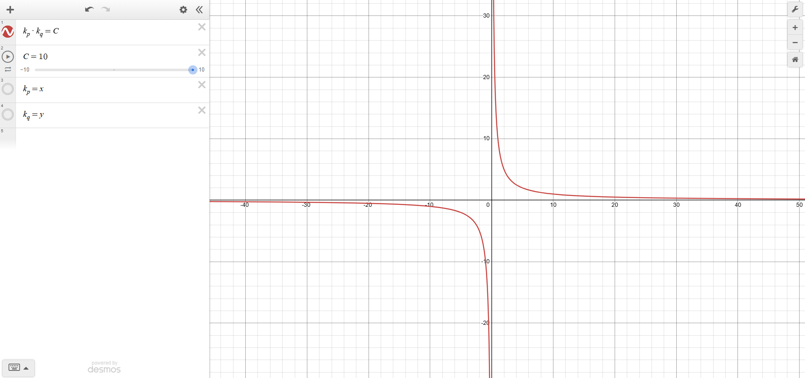
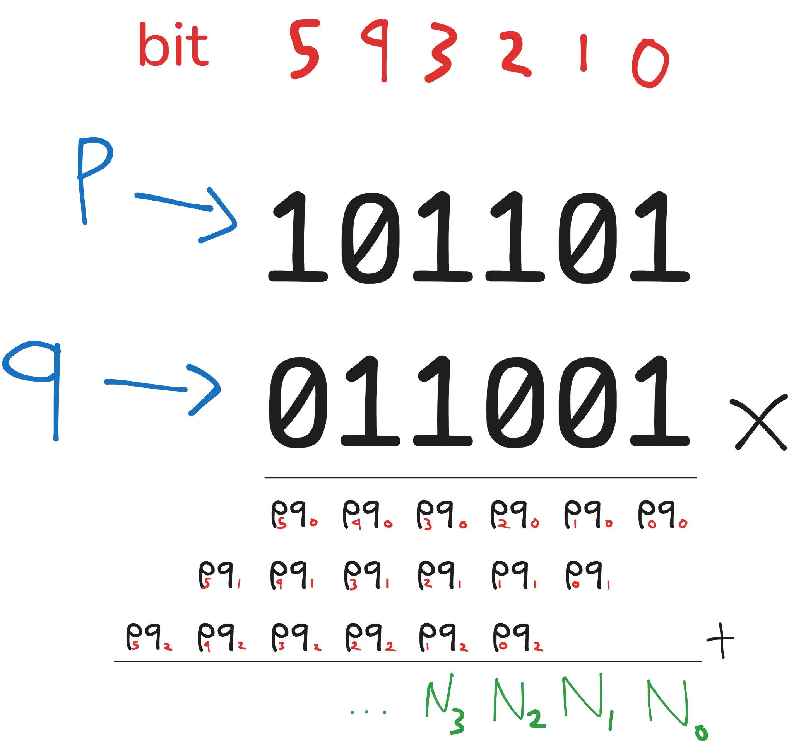

# Redacted Remainders (Upsolve)

It's 4 AM right now and I'm so tired, surely nothing bad will happen if I publish this challenge right?

Author: ringoshiro

## Analysis

```py
from Crypto.Util.number import getPrime, inverse, bytes_to_long
import random, math
from textwrap import wrap

LR = 0.28
GROUP = 4
FKP = 24
FKS = 24

def mask_bits_as_r(bs: str, hr: float, fp: int, fs: int) -> str:
    n = len(bs)
    alw_ids = list(range(n))
    if fp > 0:
        alw_ids = alw_ids[fp:]
    if fs > 0:
        alw_ids = [i for i in alw_ids if i < n - fs]
    to_hide_target = int(hr * len(alw_ids))
    to_hide = set(random.sample(alw_ids, k=min(to_hide_target, len(alw_ids))))
    masked = []
    for i, b in enumerate(bs):
        if (fp and i < fp) or (fs and i >= n - fs):
            masked.append(b)
        elif i in to_hide:
            masked.append('r')
        else:
            masked.append(b)
    return ''.join(masked)

def groupify(s: str, size: int) -> str:
    return ' '.join(wrap(s, size))

def int_to_bin(x: int) -> str:
    return bin(x)[2:]

flag = open("flag.txt", "rb").read().strip()
e = 4099
while True:
    p = getPrime(128)
    q = getPrime(128)
    n = p * q
    phi = (p - 1) * (q - 1)
    if math.gcd(e, phi) != 1:
        continue
    d = inverse(e, phi)
    dp = d % (p - 1)
    dq = d % (q - 1)
    kp = (e * dp - 1) // (p - 1)
    kq = (e * dq - 1) // (q - 1)
    if kp == 0 or kq == 0:
        continue
    break
m = bytes_to_long(flag)
if m >= n:
    raise ValueError("flag too large for modulus")
c = pow(m, e, n)
dp_bits = int_to_bin(dp)
dq_bits = int_to_bin(dq)
masked_dp = mask_bits_as_r(dp_bits, LR, FKP, FKS)
masked_dq = mask_bits_as_r(dq_bits, LR, FKP, FKS)
dp = groupify(masked_dp, GROUP)
dq = groupify(masked_dq, GROUP)
with open("output.txt", "w") as f:
    f.write(f"n={n}\n")
    f.write(f"e={e}\n")
    f.write(f"c={c}\n")
    f.write(f"dp={dp}\n")
    f.write(f"dq={dq}\n")
```

```py
n=59213204637068816907517582537717244881250709490610600160235894584144862180589

e=4099

c=52598477212363693322221974252387327725937369173109674066499283883678096102095

dp=1010 0010 0100 1111 1100 1101 r01r 0011 0101 r010 00r1 0r0r 11r0 0101 0r00 0001 rr01 1r01 1rr1 1r01 r1r1 rr01 01r1 001r 0r01 1111 1000 1011 1101 1110 1010 11

dq=1010 1110 0110 1001 1000 1011 0101 11rr 1000 0101 1100 110r 1r10 r110 0rr1 011r 110r rrr0 1r1r 01rr r110 1011 0rr1 1100 110r r1r0 1101 0001 0010 1001 1101 011
```

2 working solutions tried:

- MITM Modular Subset Sum (the GOAT used this)
- Joint-DFS implementation of Bit Lifting using Mod N constraint. (this upsolve)

Challenge is essentially a variant of a **Partial Key Exposure attack on CRT-RSA exponents**.

Instead of given 64 known contiguous lsb/msb (which calls for Coppersmith's method / LLL), we are given 24 LSBs, 24 MSBs, and ~22 scattered unknown bits (`r`) in the middle. (*cuz `LS = 0.28` and 128 total bits - 24 lsb - 24 msb = 80 bits, 0.28 * 80 = ~22 bits*)

## MITM Mod Subset Sum

Bypasses `dq`. Utilizes `mod k` to isolate the unknown bits and MITM to search $2\cdot 2^{11}$ (4096) instead of $(2^{11})^{2}$ (since 22 unknown bits with each bit that can only be either 2 states: `0` or `1` -> 2^22 = 4,194,304 possible combinations)

```py
dp = d % (p - 1)
dq = d % (q - 1)
kp = (e * dp - 1) // (p - 1)
kq = (e * dq - 1) // (q - 1)
```

> [!tip]
> $d_p < p-1 \\[1ex]\implies e\cdot d_p < e\cdot(p-1) \\[1ex]\implies e\cdot d_p-1<e\cdot (p-1)\\[1ex]\implies \dfrac{e\cdot d_p - 1}{p-1}<e\\[1ex] \implies \boxed{k < e}$

Start with $e\cdot d_p -1=k\cdot (p-1)$. We don't know $p$ but we plan to loop `k` from 1 to e. So we can `mod k` to get rid of unknown $p$.

$\boxed{e\cdot d_p -1 = 0 \pmod{k}}$. To isolate the specific unknown, split $d_p$ into $d_p = base + \delta$ (where `base` is `dp` with unknown bits `r` set to `0`, and `delta` representing the unknown bits).

$e\cdot(base + \delta) = 1 \pmod{k} \\[1ex] e\cdot base + e\cdot \delta = 1 \pmod{k}\\[1ex] e \cdot\delta = 1 - e\cdot base \pmod{k}$

It is impractical to bruteforce $2^{22}$ combinations for unknown bits $\delta$, but we can utilize *Meet in the Middle* because the later equation is strictly linear (no squares or cross terms) and fully distributive under modulo `k`.

We are able to decompose $\delta$ into $\delta = \delta_a+\delta_b$ because binary place values are additive, so we can arbitrarily split 22 unknown bits into 2 groups of 11 bits. (Decompose visualization: 1111 + 11110000  = 11111111)

$e \cdot (\delta_a + \delta_b) = 1 - e\cdot base \pmod k\\[1ex] \boxed{e\cdot\delta_a = 1 - e\cdot base - e\cdot\delta_b \pmod k}$

LHS depends only on $\delta_a$ and RHS only depends on $\delta_b$.

MiTM is done by calculating LHS first for subset A. 2^11 bit combinations (0, 1, 10, 11, ..., 11111111111) are computed for the delta in $e\cdot \delta_a$ and each combination is stored in a hash table: $\text{table}[e\cdot\delta_a \pmod k] = \delta_a$

Then calculate RHS for subset B, so compute another 2^11 bit combinations for $\delta_b$, each combination calculates RHS: $need=1 - e\cdot base - e\cdot\delta_b \pmod{k}$, and finds $\text{table}[need]$. Basically, this part looks for possible delta(s) (using LHS as key lookup) in the hash table that used RHS as key to store the specific delta combinations.

For the delta(s) found in the table, $\delta_a + \delta_b$ is yielded as the complete delta ($\delta$) to guess $d_p=base+\delta$.

Recall $e\cdot d_p -1 = 0 \pmod{k}$. With $d_p$ guess, calculate $t = e\cdot d_p - 1$, if $t$  has remainder `mod k` then retry using next delta candidate.

> [!tip]
> Recall $e\cdot d_p - 1 =  k\cdot(p-1)\\[1ex] e\cdot d_p - 1 = kp - k\\[2ex]\dfrac{e\cdot d_p - 1 + k}{k} = p\quad (\text{Substitute }t=e\cdot d_p - 1)\\[2ex]\dfrac{t+k}{k}=p\implies \boxed{p=1+\dfrac{t}{k}}$

If $t = 0 \pmod k$, calculate $p$ and $q=\dfrac{N}{p}$ then usual RSA decrypt.

Shoutout to Gengg. Though this solution still loops k=1 to 4098 and requires some patience.

```py
from Crypto.Util.number import inverse, long_to_bytes

n = 59213204637068816907517582537717244881250709490610600160235894584144862180589
e = 4099
c = 52598477212363693322221974252387327725937369173109674066499283883678096102095
dp_str = "1010 0010 0100 1111 1100 1101 r01r 0011 0101 r010 00r1 0r0r 11r0 0101 0r00 0001 rr01 1r01 1rr1 1r01 r1r1 rr01 01r1 001r 0r01 1111 1000 1011 1101 1110 1010 11"
dq_str = "1010 1110 0110 1001 1000 1011 0101 11rr 1000 0101 1100 110r 1r10 r110 0rr1 011r 110r rrr0 1r1r 01rr r110 1011 0rr1 1100 110r r1r0 1101 0001 0010 1001 1101 011"

def parse_masked_bits(masked: str):
   s = masked.replace(' ', '')
   L = len(s)
   base = 0
   unknown_pos = []
   for idx_msb, ch in enumerate(s):
       pos_lsb = L - 1 - idx_msb
       if ch == '0' or ch == '1':
           if ch == '1':
               base |= (1 << pos_lsb)
       else:
           unknown_pos.append(pos_lsb)
   return base, unknown_pos, L

def mitm_mod_subset(e, base, positions, k):
   mid = len(positions) // 2
   A = positions[:mid]
   B = positions[mid:]

   e_mod_k = e % k
   base_mod = (e_mod_k * (base % k) - 1) % k

   # All sums for A
   from collections import defaultdict
   table = defaultdict(list)
   LA = len(A)
   for mask in range(1 << LA):
       deltaA = 0
       sumA_mod = 0
       m = mask
       for i in range(LA):
           if m & 1:
               bit = A[i]
               deltaA += (1 << bit)
               sumA_mod = (sumA_mod + (e_mod_k * (1 << bit)) % k) % k
           m >>= 1
       table[sumA_mod].append(deltaA)

   LB = len(B)
   for mask in range(1 << LB):
       deltaB = 0
       sumB_mod = 0
       m = mask
       for i in range(LB):
           if m & 1:
               bit = B[i]
               deltaB += (1 << bit)
               sumB_mod = (sumB_mod + (e_mod_k * (1 << bit)) % k) % k
           m >>= 1
       need = (-base_mod - sumB_mod) % k
       if need in table:
           for deltaA in table[need]:
               yield deltaA + deltaB 

def try_recover_prime_from(masked_bits: str, n: int, e: int):
   base, unknown_positions, bitlen = parse_masked_bits(masked_bits)

   for k in range(1, e):
       print(f'\r{k=}\033[K',end='',flush=True)
       for delta in mitm_mod_subset(e, base, unknown_positions, k):
           dp_candidate = base + delta
           t = e * dp_candidate - 1
           if t % k != 0:
               continue
           p_candidate = 1 + t // k
           if p_candidate > 1 and n % p_candidate == 0:
               print(f'\n{k=} | {p_candidate}')
               return int(p_candidate)
   return None

def solve():
   p = try_recover_prime_from(dp_str, n, e)
   if p is None:
       q_try = try_recover_prime_from(dq_str, n, e)
       if q_try is None:
           raise RuntimeError("Failed to recover a prime from dp and dq")
       q = q_try
       p = n // q
   else:
       q = n // p

   phi = (p - 1) * (q - 1)
   d = inverse(e, phi)
   m = pow(c, d, n)
   flag = long_to_bytes(m)
   return flag

if __name__ == "__main__":
   flag = solve()
   print(flag)
```

```py
❯ python3 mitm.py
k=960
k=960 | p_candidate=230301127425608430303083758331863134181
b'BEECTF{b1t5_0f_ch1n3s3_c03ff5}'
```
The MiTM solution:
- uses `dp` or `dq` only
- erases `p` using `mod k`, splits search using hash table
- Time complexity $O(e\cdot 2^{11})$
- $O(2^{11})$ hash table lookups

## Joint-DFS Branch and Prune

The Branch and Prune solution:
- uses both `dp` and `dq`
- forces $q_i$ using $N \pmod{2^i}$
- Time complexity $O(candidates \cdot \text{128 bits})$ which is practically instant
- Pure tree traversal, $O(1)$ memory


The most important optimization here is estimating `k`, narrowing it down to a range of integers rather than a k=1 to 4098 loop or even a double 1 to 4098 loop. It could definitely be adapted to the previous MiTM solution.

### Bounding k



*(Simple visualization. Imagine C = large number, then find integer solutions which is pretty rare in hyperbolic curve)*

The idea is product bounding by utilizing CRT RSA equations which fortunately involve `kp` and `kq` as well as `p` and `q` which could potentially make up `N` ($p\cdot q$). This leads to hyperbolic curve(s) $k_p \cdot k_p = \text{constant}$ (constant is a range of values for $k_p \cdot k_q$), and the rest is looping `kp` from 1 to 4098 for each possible products of $k_p\cdot k_q$ (constant) and find integer solution(s) for `kp` or `kq` which is scarce in a hyperbolic curve.

Start with $e\cdot d_p -1=k_p\cdot (p-1)$. Notice constant `-1` is practically useless when working with large numbers.

$e\cdot d_p \approx k_p \cdot p\quad\implies\quad \boxed{k_p\approx\dfrac{e\cdot d_p}{p}}\quad\text{and }k_q\text{ follows:}\quad \boxed{k_q\approx\dfrac{e\cdot d_q}{q}}$

$\boxed{k_p\cdot k_q\approx\dfrac{e^2\cdot d_p \cdot d_q}{N}}$

Compute the possible range:

- Fill `r` bits with 0 in $d_p, d_q$ to get $d_{p,min}, d_{q,min}$
- Fill `r` bits with 1 in $d_p, d_q$ to get $d_{p,max}, d_{q,max}$ 

$\text{min\_prod} = \dfrac{e^2 \cdot d_{p,\text{min}} \cdot d_{q,\text{min}}}{N} - 2\\[1ex]\text{max\_prod} = \dfrac{e^2 \cdot d_{p,\text{max}} \cdot d_{q,\text{max}}}{N} + 3$

Although the range usually results in 1-2 integers, harmless extra safety bounds (-2 and +3) are added to account for algrebraic error caused by our approximation and floor division rounding in Python.

Now we know $k_p \cdot k_q$ product range from $\text{min\_prod}$ to $\text{max\_prod}$.

Loop the product range and test all `kp` from 1 to 4098 in each `kp` loop we have:

$k_p \cdot k_q = \text{constant}$

If $\text{constant} \equiv 0 \pmod {k_p}$, then find $k_q$ using known $k_p$ and $\text{constant}$:

$k_q = \dfrac{\text{constant}}{k_p}$

If $1\le k_q < e$, append valid $(k_p, k_q)$ pair in a candidate table for the Joint-DFS.

### Joint DFS

#### Intuition
The basic naive intuition starts with a DFS on $d_p$ (or $d_q$) alone from LSB to MSB.

1. Guess bit $i$ of $p$
2. Check $e \cdot d_p \equiv k_p(p - 1) + 1 \pmod{2^{i+1}}$
3. BUT when $d_p[i]$ is `r`, both guesses ($p_i = 0$ and $p_i = 1$) work

Tree branches into 2 path when it hits `r` because there's no constraint to check against, until it hits a known $d_p$ bit.

BUT pruning a branch requires contradiction from a constraint. The problem is the current guess for bit $i$ of $p$ is a free binary choice `0` or `1`. When the search hits a known bit ($d_p[i]$), the free choice guess + inherited carries is factored in to match the current bit. One choice always matches, keeping both valid and incorrect paths alive because we are only verifying a single bit channel in isolation.

$d_{p}[i]\equiv \left(k_{p}\cdot p_{i}\right)+\text{carries}_{\text{past}}\pmod 2$

A broken path with corrupted carries never dies here. Regardless of the incorrect value that $\text{carries}_{\text{past}}$ holds, toggling our guess for $p_{i}$ between `0` and `1` forces the RHS to match $d_p[i]$. Essentially, a corrupted path can always find a matching bit choice, but it can never trigger a contradiction.

Thus tree branches normally to $2^{22}$ (roughly 4 million) which is unfeasible.

#### Pivot

Involve $N = p \cdot q$ and see from a bit position perspective: 

$N_i = (p_i \cdot q_0) + (q_i \cdot p_0) + \text{carries from lower bits} \pmod 2$



For example, $N_2$ has unknown $p_2, q_2$, everything else including middle term ($p_1, q_1$) is known and grouped into $\text{carries}$.

Additionally, $p$ and $q$ are odd primes so lower bit is $1$.

$\boxed{N_i = p_i + q_i + \text{carries} \pmod 2}$

Since we are guessing $p_i$ (bit $i$ of $p$), $q_i$ is mathematically determined by N. Search space drops from 4 possible $(p_i, q_i)$ pairs: (0,0) (0,1) (1,0) (1,1), to 2 pairs since $q_i$ relies on $p_i$ (which is either `0` or `1`) since it's constrained.

#### 'Pruning' oracle

Uses $p_{cand}$ (and $q_{cand}$) being the candidate $p$ (and $q$) which has been built bit-by-bit up to the current bit in a specific branch of the search tree, to compute $d_{p,cand}, d_{q,cand}$ if it matches actual $d_p$ or $d_q$. If a check contradicts, the branch is pruned.

Recall: $e\cdot d_p - 1 =  k_p(p-1)$. Look at the equation up to current bit:

$e\cdot d_p \equiv k_p(p-1) +1 \pmod{2^{i+1}}$

Fortunately, $e$ is odd thus coprime to powers of $2$, so the inverse $e^{-1} \pmod{2^{i+1}}$ exists.

$d_p \equiv e^{-1}\cdot k_p(p-1) +1 \pmod{2^{i+1}}$

This means we can compute the first $i+1$ bits (from $0$ to $i$) of candidate $d_p$ and $d_q$.

$d_{p,\text{cand}} \equiv e^{-1} \cdot (k_p(p_{\text{cand}} - 1) + 1) \pmod{2^{i+1}}\\[1.5ex]d_{q,\text{cand}} \equiv e^{-1} \cdot (k_q(q_{\text{cand}} - 1) + 1) \pmod{2^{i+1}}$

Then check if:

- bit $i$ of $d_{p,cand}$ matches $d_p$
- bit $i$ of $d_{q,cand}$ matches $d_q$

If bit of $d_p$ OR $d_q$ is `r` (unknown), it still works and prunes incorrect branches because $p_i$ forces $q_i$ -> $q_{cand}$ mathematically. If $d_p$ can't be checked, then if $d_q$ check fails then it prunes the current $p_i,q_i$ pair cuz if $q_i$ is wrong then $p_i$ is also wrong.

More importantly, for a false candidate branch to survive is for BOTH current bit of $d_p, d_q$ = `r`. But code says `LS = 0.28` which hides 28% of the middle 80 bits. Probability of both bit of dp and dq being `r` is P(dp is `r`) * P(dq is `r`) = 0.28 * 0.28 = 0.0784 = 7.84%. This means 92.2% of the time, atleast 1 of the 2 channels is unmasked and instantly prunes the incorrect $p_i$ guess. So the DFS tree never grows beyond 2-4 states.

Essentially, the solution is just `k` estimation + branch and prune by guessing $p$ bit-by-bit + $d_p, d_q$ oracle that keeps the DFS tree short.

When loop reaches bit 127, the surviving $p_{cand}$ and $q_{cand}$ are the prime factors. Simply check if $p\cdot q = N$ then usual RSA decryption.

```py
from Crypto.Util.number import inverse, long_to_bytes

n = 59213204637068816907517582537717244881250709490610600160235894584144862180589
e = 4099
c = 52598477212363693322221974252387327725937369173109674066499283883678096102095
dp_str = "1010 0010 0100 1111 1100 1101 r01r 0011 0101 r010 00r1 0r0r 11r0 0101 0r00 0001 rr01 1r01 1rr1 1r01 r1r1 rr01 01r1 001r 0r01 1111 1000 1011 1101 1110 1010 11"
dq_str = "1010 1110 0110 1001 1000 1011 0101 11rr 1000 0101 1100 110r 1r10 r110 0rr1 011r 110r rrr0 1r1r 01rr r110 1011 0rr1 1100 110r r1r0 1101 0001 0010 1001 1101 011"

def get_char_at_bit(bit_string, bit_idx):
    """Safely fetch the bit character at position `bit_idx` (0 = LSB).
    If we ask for a bit beyond the string length, it's implicitly '0'."""
    str_idx = len(bit_string) - 1 - bit_idx
    if str_idx < 0:
        return '0'
    return bit_string[str_idx]

def solve_rsa(n, e, c, dp_str, dq_str):
    # 1. Strip spaces in strings
    dp_str = dp_str.replace(" ", "")
    dq_str = dq_str.replace(" ", "")

    # 2. Min/Max boundaries for the missing bits
    dp_min = int(dp_str.replace('r', '0'), 2)
    dp_max = int(dp_str.replace('r', '1'), 2)
    
    dq_min = int(dq_str.replace('r', '0'), 2)
    dq_max = int(dq_str.replace('r', '1'), 2)

    # 3. Calculate Product Window with the safety bounds
    min_prod = max(1, (e**2 * dp_min * dq_min) // n - 2)
    max_prod = (e**2 * dp_max * dq_max) // n + 3

    print(f"[*] Targeting kp*kq product range: [{min_prod}, {max_prod}]")

    # 4. Search for valid (kp, kq) pairs
    candidates = []
    for kp in range(1, e):
        for target_prod in range(min_prod, max_prod + 1):
            if target_prod % kp == 0:
                kq = target_prod // kp
                if 1 <= kq < e:
                    candidates.append((kp, kq))

    # Remove dupes
    candidates = list(set(candidates))
    print(f"[*] Found {len(candidates)} candidate (kp, kq) pairs.")

    # 5. Joint-DFS
    for kp, kq in candidates:
        # states hold: (p_val, q_val)
        states = [(1, 1)] 
        
        # p and q are exactly 128 bits long
        for i in range(1, 128):
            if not states:
                break 
            
            next_states = []
            mod_mask = (1 << (i + 1))
            e_inv = inverse(e, mod_mask)
            
            for p_val, q_val in states:
                for p_i in (0, 1):
                    p_cand = p_val | (p_i << i)
                    
                    # Constraint 1: Modulus N (Forces q_i)
                    q_i = ((n - p_cand * q_val) >> i) & 1
                    q_cand = q_val | (q_i << i)
                    
                    if (p_cand * q_cand) % mod_mask != n % mod_mask:
                        continue
                        
                    # Constraint 2: Oracle Check
                    dp_cand = (e_inv * (kp * (p_cand - 1) + 1)) % mod_mask
                    dq_cand = (e_inv * (kq * (q_cand - 1) + 1)) % mod_mask
                    
                    dp_bit = (dp_cand >> i) & 1
                    dq_bit = (dq_cand >> i) & 1
                    
                    # Constraint 3: Compare against masked strings safely
                    dp_char = get_char_at_bit(dp_str, i)
                    dq_char = get_char_at_bit(dq_str, i)
                    
                    dp_match = (dp_char == 'r') or (int(dp_char) == dp_bit)
                    dq_match = (dq_char == 'r') or (int(dq_char) == dq_bit)
                    
                    if dp_match and dq_match:
                        next_states.append((p_cand, q_cand))
                        
            states = next_states
        
        # 6. Verify p and q
        for p_final, q_final in states:
            if p_final * q_final == n:
                print(f"[+] Factored N")
                print(f"[+] p: {p_final}")
                print(f"[+] q: {q_final}")
                print(f"[+] {kp=} {kq=}")
                
                phi = (p_final - 1) * (q_final - 1)
                d = inverse(e, phi)
                m = pow(c, d, n)
                print(f"\n[+] Flag: {long_to_bytes(m).decode(errors='ignore')}")
                return

    print("[-] DFS exhausted. No valid factors found.")

solve_rsa(n, e, c, dp_str, dq_str)
```

```sh
❯ python3 jointdfs.py
[*] Targeting kp*kq product range: [1774077, 1774083]
[*] Found 80 candidate (kp, kq) pairs.
[+] Factored N
[+] p: 230301127425608430303083758331863134181
[+] q: 257112091890196191120632032861207384169
[+] kp=960 kq=1848

[+] Flag: BEECTF{b1t5_0f_ch1n3s3_c03ff5}
```