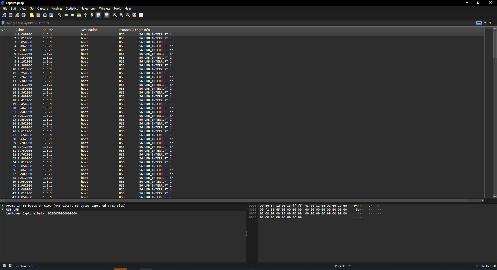

# sudah lama

Sudah lama tidak ketemu soal seperti ini, semoga memperbanyak ilmu kalian, cemungut BeeCTF.

Author: wavess

## Analysis

Given `capture.pcap`.

Strings resulted in nothing useful:

```sh
❯ strings capture.pcap
Se <
Se0W
Se`I
Sepd
Se0'
Se <
Se0W
Se`I
Sepd
Se0'
Se <
```

Wireshark analysis shows `URB_INTERRUPT in` traffic (not usual TCP requests), which are Human Interface Devices (HIDs) like keyboards and mouse.



It's possible to extract all leftover data to a single file and map out the usb key codes and build script:
```sh
# Extract
tshark -r capture.pcap -Y "usb.transfer_type == 0x01" -T fields -e usb.capdata > test.txt
```

However, a quick search reveals that such a tool already exists, so let's utilize https://github.com/shark-asmx/CTF-Usb_Keyboard_Parser

```
❯ python3 Usb_Keyboard_Parser.py capture.pcap

[+] Using filter "usb.capdata" Retrived HID Data is :

BeeCTF{sud4h_l4ma_t1dak_bu4t_s0al_s3p3rti_1ni}
```

Flag: `BeeCTF{sud4h_l4ma_t1dak_bu4t_s0al_s3p3rti_1ni}`