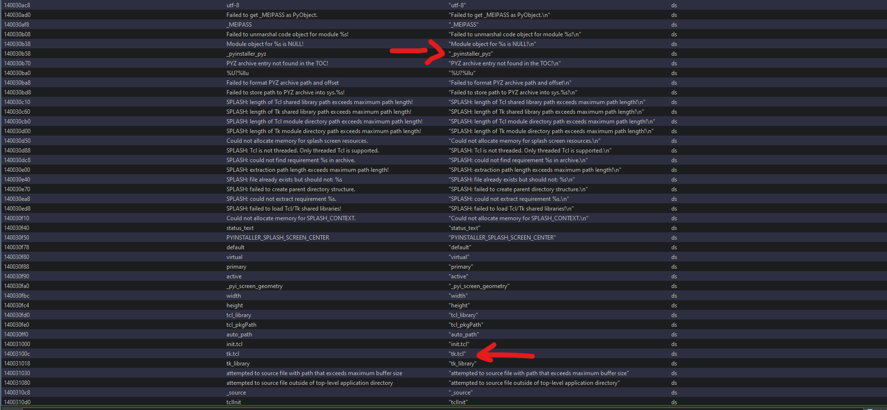

# zzzz

im sleepy, im gonna let it run while im sleepin. hmmm, those squares... feels like... there's something...

Author: 🦦

## Analysis

Given `zzzz.scr`

```sh
❯ file zzzz.dangerous 
zzzz.dangerous: PE32+ executable (GUI) x86-64, for MS Windows
```

Upon opening it in Ghidra, the functions were somewhat unclear, but looking at the defined strings revealed that the program was built with Tkinter and compiled using PyInstaller.



I utilized [PyInstxtractor](https://github.com/extremecoders-re/pyinstxtractor) to extract the contents and [PyLingual](https://pylingual.io/) to convert `zzzz.pyc` to a `.py` file.

```py
import os
import random
import sys
import tkinter as tk
idk = 'aEbOaqadaCapauaxacbiaCaEaFaLaSbPaCbKbGbtaxbqbLajbIaqbtbvbobJbiafalbtasbobLaraTabauapbnbebibLbeaibdabaXafafaabuaiagbLbCbLacbuapaXbN'
def encrypt(data):
    _ = 'abcdefghijklmnopqrstuvwxyzABCDEFGHIJKLMNOPQRSTUVWXYZ{}'
    data = data[::(-1)]
    data = list(data)
    _n = len(data)
    for _i in range(_n):
        _j = (_i * 5 + 3) % _n
        _tmp = data[_i]
        data[_i] = data[_j]
        data[_j] = _tmp
    data = ''.join(data)
    _k = bytes([115, 110, 97, 107, 101, 122, 122])
    _out = bytearray()
    for _i, _c in enumerate(data.encode()):
        _r = _k[_i % len(_k)]
        _v = _c ^ _r
        _out.append(_v)
    _final = []
    for _v in _out:
        _a = _v // len(_)
        _b = _v - _a * len(_)
        _final.append(_[_a])
        _final.append(_[_b])
    return ''.join(_final)
root = tk.Tk()
root.attributes('-fullscreen', True)
root.configure(bg='black')
width = root.winfo_screenwidth()
height = root.winfo_screenheight()
canvas = tk.Canvas(root, bg='black', highlightthickness=0)
canvas.pack(fill='both', expand=True)
for y in range(0, height, 120):
    for x in range(0, width, 300):
        canvas.create_text(x, y, text='🦖🦖🦖🦖🦖🦖🦖🦖🦖', fill='#222222', font=('Arial', 40, 'bold'), anchor='nw')
def get_random_color():
    return f'#{random.randint(48, 255):02x}{random.randint(48, 255):02x}{random.randint(48, 255):02x}'
balls = []
for char in idk:
    size = random.randint(100, 140)
    x = random.randint(0, max(1, width - size))
    y = random.randint(0, max(1, height - size))
    color = get_random_color()
    rect_obj = canvas.create_rectangle(x, y, x + size, y + size, fill=color, outline='')
    font_size = int(size * 0.4)
    text_obj = canvas.create_text(x + size // 2, y + size // 2, text=char, fill='white', font=('Arial', font_size, 'bold'))
    dx = random.choice([(-1), 1]) * random.randint(3, 12)
    dy = random.choice([(-1), 1]) * random.randint(3, 12)
    balls.append({'rect': rect_obj, 'text': text_obj, 'x': x, 'y': y, 'dx': dx, 'dy': dy, 'size': size})
def animate():
    for ball in balls:
        ball['x'] += ball['dx']
        ball['y'] += ball['dy']
        size = ball['size']
        bounced = False
        if ball['x'] <= 0 or ball['x'] + size >= width:
            ball['dx'] *= (-1)
            ball['x'] = max(0, min(ball['x'], width - size))
            bounced = True
        if ball['y'] <= 0 or ball['y'] + size >= height:
            ball['dy'] *= (-1)
            ball['y'] = max(0, min(ball['y'], height - size))
            bounced = True
        if bounced:
            new_color = get_random_color()
            canvas.itemconfig(ball['rect'], fill=new_color)
        canvas.coords(ball['rect'], ball['x'], ball['y'], ball['x'] + size, ball['y'] + size)
        canvas.coords(ball['text'], ball['x'] + size // 2, ball['y'] + size // 2)
    root.after(16, animate)
def cleanup_and_exit(event=None):
    root.destroy()
    sys.exit(0)
initial_mouse_pos = None
root.bind('<Key>', cleanup_and_exit)
root.bind('<Button-1>', cleanup_and_exit)
root.bind('<Button-2>', cleanup_and_exit)
root.bind('<Button-3>', cleanup_and_exit)
animate()
root.mainloop()
```

Simply just write the decrypt function

```py
_final = []
for _v in _out:
    _a = _v // len(_) # quotient, len charset = 26+26+2=54
    _b = _v - _a * len(_) # remainder
    _final.append(_[_a])
    _final.append(_[_b])
return ''.join(_final)
```

Reverse is just getting `a = final[i], b = final[i+1]`, then `v = a*54 + b`

```py
_k = bytes([115, 110, 97, 107, 101, 122, 122]) # snakezz
_out = bytearray()
for _i, _c in enumerate(data.encode()):
    _r = _k[_i % len(_k)]
    _v = _c ^ _r    # repeating xor "snakezz"
    _out.append(_v)
```

No need reverse since XORing again restores the original byte.

```py
_ = 'abcdefghijklmnopqrstuvwxyzABCDEFGHIJKLMNOPQRSTUVWXYZ{}'
data = data[::(-1)]
data = list(data)
_n = len(data)
for _i in range(_n):
    _j = (_i * 5 + 3) % _n
    _tmp = data[_i]
    data[_i] = data[_j]
    data[_j] = _tmp
data = ''.join(data)
```

A little tricky but every `i` (from 0 to n-1), it calculates a predictable `j` and swaps. So the reverse is just looping from n-1 to 0 to correctly calculate `j` using the current `i` used for the swap, to undo the swap.

Last bit is just reversing data. So decrypt function (solution) is:

```py
def decrypt(data):
    chars = 'abcdefghijklmnopqrstuvwxyzABCDEFGHIJKLMNOPQRSTUVWXYZ{}'

    out = bytearray()
    for i in range(0, len(data), 2):
        a = chars.index(data[i])
        b = chars.index(data[i+1])
        out.append(a * len(chars) + b)

    key = b'snakezz'
    for i in range(len(out)):
        out[i] ^= key[i % len(key)]

    text = list(out.decode())
    n = len(text)
    for i in range(n-1, -1, -1):
        j = (i*5+3) % n
        text[i], text[j] = text[j], text[i]
    return ''.join(text)[::-1]

print(decrypt('aEbOaqadaCapauaxacbiaCaEaFaLaSbPaCbKbGbtaxbqbLajbIaqbtbvbobJbiafalbtasbobLaraTabauapbnbebibLbeaibdabaXafafaabuaiagbLbCbLacbuapaXbN'
))
```

```sh
❯ python3 solve.py 
BeeCTF{7h3_wh33l_g035_r0und_r0und_r0und_py7h0n15un1qu3_50m371m35}
```

Flag: `BeeCTF{7h3_wh33l_g035_r0und_r0und_r0und_py7h0n15un1qu3_50m371m35}`