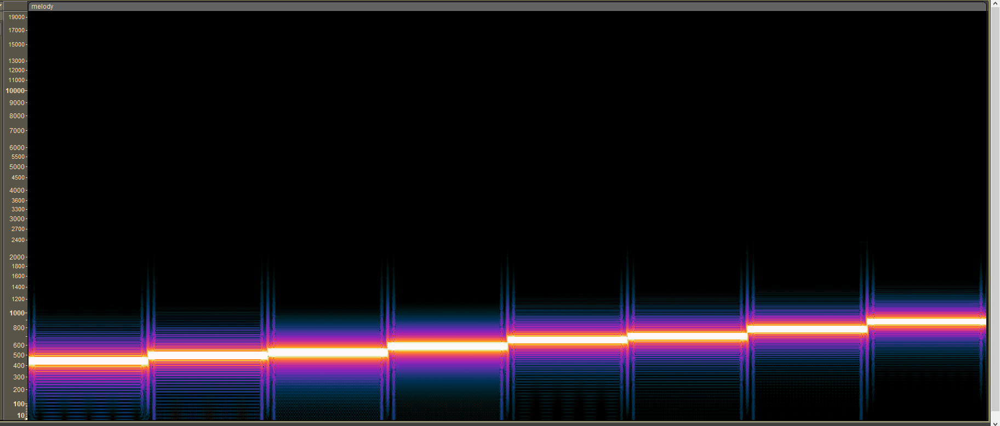

# harmoniccipher

**CTF:** Tracebash CTF

**Category:** crypto

**Difficulty:** 

**Tags:**

**Author:** CYB3RFY

**Date:** June 2026

## Analysis
Opened `melody.wav` and heard A minor scale: ABCDEFGA.

Then checked the spectrogram view in Audacity:



Basically just A minor scale starting at standard 440hz. Intuitively, keep in mind the A minor scale in frequency form: `440, 494, 523, 587, 659, 698, 784, 880`.

Then I leveraged a Known Plaintext Attack since flag starts with `TBCTF{`. XORing raw bytes of `cyphertext.bin` against `TBCTF{` resulted in `184, 238, 11, 75, 147, 186`.

```py
with open("ciphertext.bin", "rb") as f:
    ciphertext = f.read()

for x,y in zip(ciphertext,'TBCTF{'):
    print(x^ord(y),end=' ')

# Output: 184 238 11 75 147 186 
```

Next intuition is to check if frequency form 440hz (A) and 184 is mathematically related. Represent the frequencies and the 6 digits in hex:

```py
A minor hz: 0x01B8, 0x01EE, 0x020B, 0x024B, 0x0293, 0x02BA, 0x0310, 0x0370
6 digits: 0xB8, 0xEE, 0x0B, 0x4B, 0x93, 0xBA
```

By pattern matching, low byte of frequency = XOR keystream. So, append `0x10` and `0x70` to complete the keystream.

```py
0xB8, 0xEE, 0x0B, 0x4B, 0x93, 0xBA, 0x10, 0x70
184, 238, 11, 75, 147, 186, 16, 112 # in decimal representation
```
## Solution
Each byte of `ciphertext.bin` is XORed against repeated keystream `[184, 238, 11, 75, 147, 186, 16, 112]`. (kinda like Vigenere cipher)

`solve.py`
```py
with open("ciphertext.bin", "rb") as f:
    ciphertext = f.read()

# for x,y in zip(ciphertext,'TBCTF{'):
#     print(x^ord(y),end=' ')

# Output: 184 238 11 75 147 186 
# low bytes of hex of freq

Aminor = [440, 494, 523, 587, 659, 698, 784, 880]
low = [h&0xff for h in Aminor]
print(low)

for i in range(len(ciphertext)):
    print(chr(ciphertext[i]^low[i%len(low)]),end='')
```
Output
```
[184, 238, 11, 75, 147, 186, 16, 112]
TBCTF{h4rm0n1c_fr3qu3nc13s_4r3_m3l0d1c}
```
<!-- ## Mitigation -->
<!-- Include if the challenge reflects a real-world vulnerability worth noting. -->

## Conclusion

Flag: `TBCTF{h4rm0n1c_fr3qu3nc13s_4r3_m3l0d1c}`