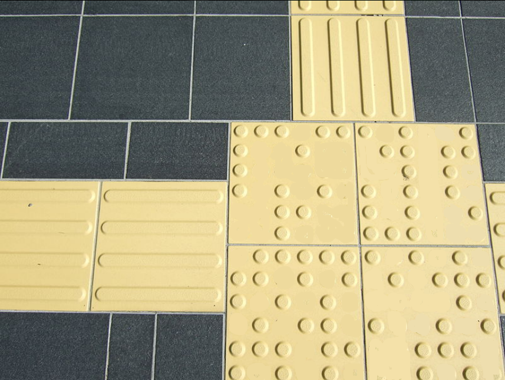
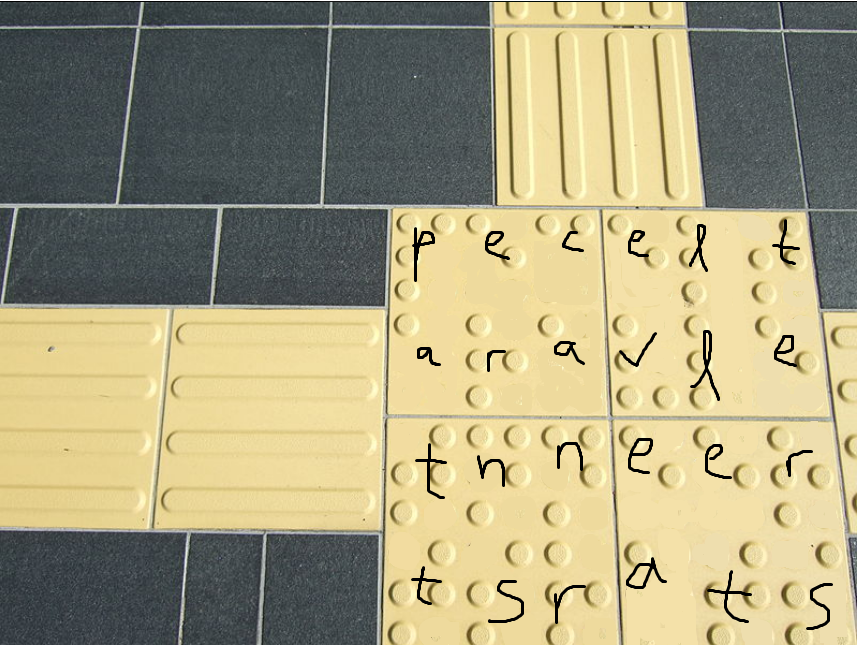

# followtheyellow

**CTF:** Tracebash CTF

**Category:** misc

**Difficulty:** 

**Tags:**

**Author:** 

**Date:** June 2026

## Analysis

Google Lens'd the image, apparently it's some "Tenji blocks" / braille blocks.

I took a couple minutes only to realize some dots are actually missing in the challenge image compared to the real original "Tenji blocks" image. That led to identifying it as English braille.
## Solution

Matching 2x3 blocks to the standard English braille alphabet:

Reading top-bottom, left-right reads "patternscanrevealletters".

<!-- ## Mitigation -->
<!-- Include if the challenge reflects a real-world vulnerability worth noting. -->

## Conclusion

Flag: `TBCTF{patternscanrevealletters}`