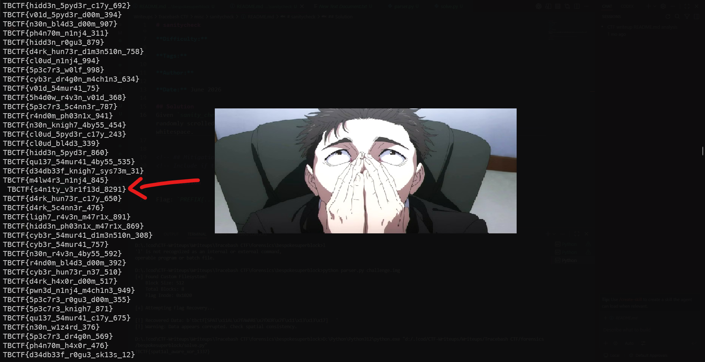

# sanitycheck

**CTF:** Tracebash CTF

**Category:** misc

**Difficulty:** 

**Tags:**

**Author:**

**Date:** June 2026

## Solution
Given `sanity_check.zip` with around 8k valid-looking flags in form of txts, I spent minutes not knowing what to do. I opened 1 by 1 and observed the similar flag phrases followed by numbers, skimmed through the filenames. Nothing.

I `unzip -p sanity_check.zip` and randomly scrolled (in medium speed) until smth flickered and I found one txt file that starts with a whitespace.



A more random but efficient intuitive method involves sorting substrings and counting occurrences because of the repeated flag phrase templates.

```bash
❯ unzip -p sanity_check.zip | awk '{print substr($0, 1, 10)}' | sort | uniq -c
      1  TBCTF{s4n
    492 TBCTF{5h4d
    483 TBCTF{5p3c
    491 TBCTF{cl0u
    507 TBCTF{cyb3
    522 TBCTF{d34d
    501 TBCTF{d4rk
    494 TBCTF{gh05
    493 TBCTF{hidd
    537 TBCTF{ligh
    478 TBCTF{m4lw
    556 TBCTF{n30n
    485 TBCTF{ph4n
    458 TBCTF{pwn3
    517 TBCTF{qu13
    519 TBCTF{r4nd
    467 TBCTF{v01d
```

Then just `grep` whitespace or the phrase

```bash
❯ unzip -p sanity_check.zip | grep " "
 TBCTF{s4n1ty_v3r1f13d_8291}
 ```
<!-- ## Mitigation -->
<!-- Include if the challenge reflects a real-world vulnerability worth noting. -->

## Conclusion

Flag: `TBCTF{s4n1ty_v3r1f13d_8291}`