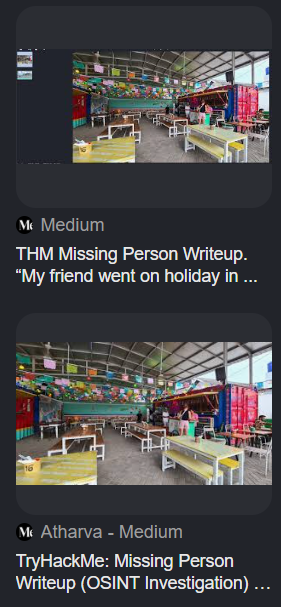
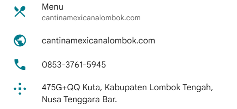
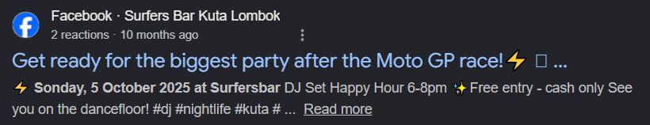
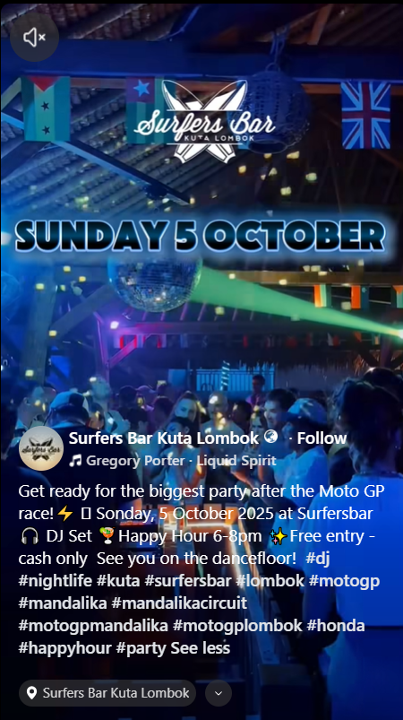

# missingfriend

**CTF:** Tracebash CTF

**Category:** osint

**Difficulty:** 

**Tags:**

**Author:**

**Date:** June 2026

## Solution
Challenge gives `food.jpg` and `MotoGP.jpg`. I used google lens to find out where the places are at.

`food.jpg` is Cantina Mexicana in Kuta Lombok, `MotoGP` is Pertamina Mandalika International Street Circuit.

And a surprise from the visual search, looks like this challenge is stolen from TryHackMe's "Missing Person".

Iirc the challenge needs the google plus code of the bar place for after party of MotoGP 2025, but I remember putting Google plus code of "Cantina Mexicana" restaurant as flag and it worked. Iirc flag is `TBCTF{475G+QQ}`.

But to actually find the bar, searching with keywords like `party motogp 2025 kuta lombok` shows a mention of a bar called "Surfers Bar" which has the plus code `474H+XM`, but doesn't work as the flag. (`474H+XM Kuta, Kabupaten Lombok Tengah, Nusa Tenggara Bar`)

<!-- ## Mitigation -->
<!-- Include if the challenge reflects a real-world vulnerability worth noting. -->

## Conclusion

Flag: `TBCTF{475G+QQ}` (i think)