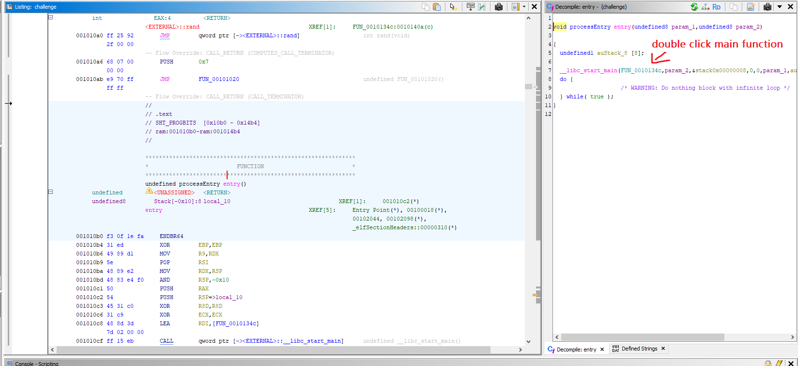

# layercake

**CTF:** Tracebash CTF

**Category:** rev

**Difficulty:** 

**Tags:**

**Author:**

**Date:** June 2026

## Analysis
Analyze using Ghidra



```c
undefined8 FUN_0010134c(int param_1,undefined8 *param_2)
{
  uint uVar1;
  int iVar2;
  undefined8 uVar3;
  time_t tVar4;
  long in_FS_OFFSET;
  char local_58 [26];
  undefined1 uStack_3e;
  long local_10;
  
  local_10 = *(long *)(in_FS_OFFSET + 0x28);
  if (param_1 == 2) {
    uVar1 = atoi((char *)param_2[1]);
    if (((int)uVar1 < 0) || (0xff < (int)uVar1)) {
      puts("Key must be 0-255");
      uVar3 = 1;
    }
    else {
      memcpy(local_58,&DAT_00104050,0x1a);
      tVar4 = time((time_t *)0x0);
      srand((uint)tVar4);
      iVar2 = rand();
      FUN_00101303(local_58,0x1a,(char)iVar2 + (char)(iVar2 / 100) * -100);
      FUN_001012ad(local_58,0x1a);
      FUN_001011f2(local_58,0x1a,1);
      FUN_001011a9(local_58,0x1a,uVar1 & 0xff);
      uStack_3e = 0;
      puts(local_58);
      uVar3 = 0;
    }
  }
  else {
    printf("Usage: %s <key 0-255>\n",*param_2);
    uVar3 = 1;
  }
  if (local_10 != *(long *)(in_FS_OFFSET + 0x28)) {
                    /* WARNING: Subroutine does not return */
    __stack_chk_fail();
  }
  return uVar3;
}
```
---

Notice `uVar1` is our inputted key:
```c
if (((int)uVar1 < 0) || (0xff < (int)uVar1)) {
    puts("Key must be 0-255");
    ...
```

Notice code inputted current unix epoch time to `srand` and calls `rand`. Unix Epoch time only increments once per second, so for a whole second, the epoch time value is the same.
```c
tVar4 = time((time_t *)0x0);
srand((uint)tVar4);
iVar2 = rand();
```

26 byte buffer loaded into `local_58` -> 4 static mutations -> `puts`. Notice `iVar2` goes through `mod 100`, meaning only a random number 0-99 is modifying the data here. `uVar1` is also used to modify the output.
```c
memcpy(local_58,&DAT_00104050,0x1a);
...
FUN_00101303(local_58,0x1a,(char)iVar2 + (char)(iVar2 / 100) * -100); // compiler way for iVar2 mod 100
FUN_001012ad(local_58,0x1a);
FUN_001011f2(local_58,0x1a,1);
FUN_001011a9(local_58,0x1a,uVar1 & 0xff); // our inputted key (0-255)
```
## Solution

Since time changes second by second, running a quick loop that lasts under 1 second will guarantee the same first random number: `./challenge -> srand(same epoch time) -> rand()`. Thus, we only need to bruteforce 0-255 keys.
```bash
for key in {0..255}; do 
    res=$(./challenge $key 2>/dev/null | tr -cd '[:print:]\n')
    if [[ "$res" == *"TBCTF"* ]] || [[ "$res" == *"{"* ]]; then
        echo "potential $key: $res"
    fi
done
```

Doesn't guarantee flag but with 2-3 tries it works.

Example output:
```python
potential 172: 1'?&>{&+3y88y<y89y7
potential 174:
3%=$<y$)1{::{>{:;{5
potential 194: pfgpb_IQHP{HE]V{VRVWY
potential 201: {ml{iTBZC[pCNV]p]Y]\R
potential 219: i~i{FPHQIbQ\DObOKON@
potential 222: lz{l~CUMTLgTYAJgJNJKE
potential 223: m{zmBTLUMfUX@
KfK
O
KJ
D
potential 224: RDER@}ksjr7Yjg5tYt5p5tu5{
potential 228: V@AVDyownv3]nc{1p]p1t1pq1
potential 230: TBCTF{mult1_lay3r_r3v3rs3} # FLAG HERE //////////////
potential 232: ZLMZHuc{bz?Qbow=|Q|=x=|}=s
potential 233: [ML[Itbzc{>Pcnv<}P}<y<}|<r
potential 235: YONYKv`xay<Ralt>R>{>~>p
potential 238: \JK\Nse}d|9Wdiq;zWz;~;z{;u
potential 239: ]KJ]Ord|e}8Vehp:{V{::{z:t
potential 240: BTUBPm{czb'Izwo%dId%`%de%k
potential 241: CUTCQlzb{c&H{vn$eHe$a$ed$j
potential 252: NXYNwovn+Ev{c)hEh)l)hi)g
```
<!-- ## Mitigation -->
<!-- Include if the challenge reflects a real-world vulnerability worth noting. -->

## Conclusion

Flag: `TBCTF{mult1_lay3r_r3v3rs3}`