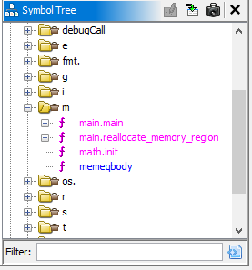
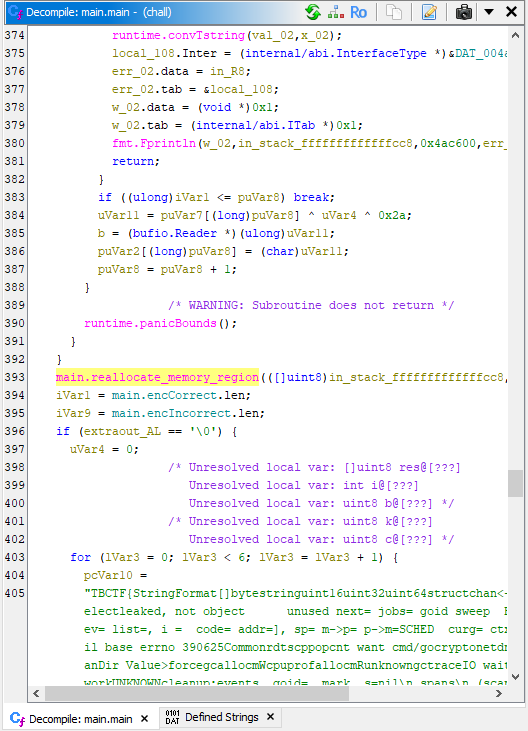
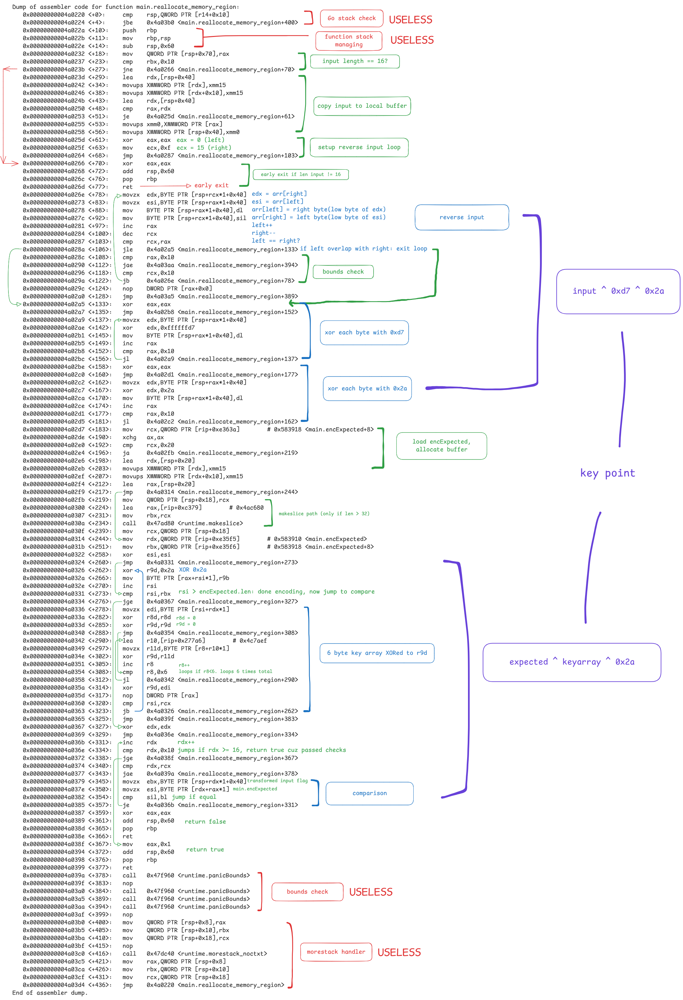

# something

**CTF:** Tracebash CTF

**Category:** rev

**Difficulty:** 

**Tags:** Go, x86-64, GDB, XOR, Obfuscation

**Author:** S31ZUR3

**Date:** June 2026

## Analysis
```bash
❯ file chall
chall: ELF 64-bit LSB executable, x86-64, version 1 (SYSV), statically linked, Go BuildID=1KMU9q5WoVfz0WS7pOjk/k4GT-zoMVL69dac9bKre/G14rAUmlUBcQHWVnuR36/pCup8Osff_HIfnFT2yZF, BuildID[sha1]=bbaddd8867d695d6d98f6ffe6c911760a74e662c, with debug_info, not stripped
```

So I used Ghidra to analyze functions



and `nm` for symbols:

```bash
❯ nm chall | grep "main\."
000000000057ebe0 D go:main.inittasks
00000000005838f0 D main.encCorrect
0000000000583910 D main.encExpected
0000000000583870 D main.encFake1
0000000000583890 D main.encFake3
00000000005838b0 D main.encFake4
00000000005838d0 D main.encFake5
0000000000583850 D main.encIncorrect
0000000000583830 D main.encPrompt
00000000005a90f8 B main.flagState
00000000004a03e0 T main.main
00000000004a0220 T main.reallocate_memory_region
0000000000475ae0 T runtime.main.func1
0000000000449400 T runtime.main.func2
```

`main.reallocate_memory_region` is a suspiciously named function written in main, so I checked where it is ever called

Looking in `main.main`, found a call to the function in line 393



After `main.reallocate_memory_region` call is a check if `AL` is `\0` (false) then does something with `encCorrect` and `encIncorrect` and `fmt.Println` so presumably that's printing Correct/Incorrect flag output. Now we can focus on `main.reallocate_memory_region`.

Since Ghidra C decompiler has issues with Go runtime string pack blob and weird castings and useless variables appearing, I relied on assembly using `gdb`:

```bash
❯ gdb ./chall
...

pwndbg> break main.main
Breakpoint 1 at 0x4a03e0: file /home/s31zur3/rev/go-chall/main.go, line 161.
pwndbg> run
...

Thread 1 "chall" hit Breakpoint 1, main.main () at /home/s31zur3/rev/go-chall/main.go:161
...
```

Then disassemble using `disassemble main.reallocate_memory_region`:



From assembly analysis, we know our input is transformed and compared byte by byte against a decrypted version of `main.encExpected`, but we don't know `main.encExpected` yet.

From the disassembler:

```bash
0x00000000004a0314 <+244>:   mov    rdx,QWORD PTR [rip+0xe35f5]        # 0x583910 <main.encExpected>
```

Because it's a Go string, the symbol itself is a header containing an 8-byte pointer followed by an 8-byte length.

```bash
pwndbg> x/2gx &main.encExpected
0x583910 <main.encExpected>:    0x000000000057e5a0      0x0000000000000010
```

Actual raw encrypted bytes are at `0x57e5a0` with length `0x10` (16)

```bash
pwndbg> x/16bx 0x57e5a0
0x57e5a0:       0xca    0x89    0xdb    0x99    0x8d    0x86    0xd8    0x86
0x57e5a8:       0xb4    0x99    0xdb    0x93    0xb4    0x9d    0xd8    0x99
```

Assembly showed a loop running 6 times, pulling bytes from address `0x4c7aef`, and XORing them into register `r9d`.

```bash
0x00000000004a0342 <+290>:   lea    r10,[rip+0x277a6]        # 0x4c7aef
```

```bash
pwndbg> x/6bx 0x4c7aef
0x4c7aef:       0x54    0x42    0x43    0x54    0x46    0x7b
```

## Solution
According to assembly analysis, `reverse(input) ^ 0xd7 ^ 0x2a = expected ^ keyarray ^ 0x2a`. `0x2a` cancels out. Solve for `input`.

```python
reverse(input) ^ 0xd7 = expected ^ keyarray
input = reverse(expected ^ keyarray ^ 0xd7)
```

```python
enc_bytes = [
    0xca, 0x89, 0xdb, 0x99, 0x8d, 0x86, 0xd8, 0x86,
    0xb4, 0x99, 0xdb, 0x93, 0xb4, 0x9d, 0xd8, 0x99
]

key_array = [0x54 ,   0x42 ,   0x43  ,  0x54  ,  0x46   , 0x7b] 

sixbytes = 0
for k in key_array:
    sixbytes ^= k

# Apply the math: Expected ^ sixbytes ^ 0xd7
d7_xor = 0xd7
decrypted_bytes = [b ^ sixbytes ^ d7_xor for b in enc_bytes]

# Reverse the string
flag_inner = "".join(chr(b) for b in reversed(decrypted_bytes))

print(f"TBCTF{{{flag_inner}}}") # Output: TBCTF{r3v_x0r_m3mfr0b!}
```

<!-- ## Mitigation -->
<!-- Include if the challenge reflects a real-world vulnerability worth noting. -->

## Conclusion

Flag: `TBCTF{r3v_x0r_m3mfr0b!}`