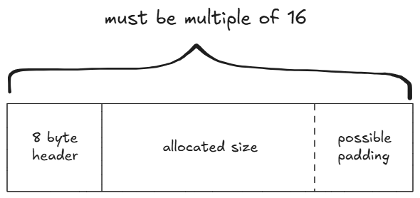

# memcpy

## Analysis
```c
// gcc -o memcpy memcpy.c -m32 -lm
#include <stdio.h>
#include <string.h>
#include <stdlib.h>
#include <signal.h>
#include <unistd.h>
#include <sys/mman.h>
#include <math.h>

unsigned long long rdtsc(){
        asm("rdtsc");
}

char* slow_memcpy(char* dest, const char* src, size_t len){
        int i;
        for (i=0; i<len; i++) {
                dest[i] = src[i];
        }
        return dest;
}

char* fast_memcpy(char* dest, const char* src, size_t len){
        size_t i;
        // 64-byte block fast copy
        if(len >= 64){
                i = len / 64;
                len &= (64-1);
                while(i-- > 0){
                        __asm__ __volatile__ (
                        "movdqa (%0), %%xmm0\n"
                        "movdqa 16(%0), %%xmm1\n"
                        "movdqa 32(%0), %%xmm2\n"
                        "movdqa 48(%0), %%xmm3\n"
                        "movntps %%xmm0, (%1)\n"
                        "movntps %%xmm1, 16(%1)\n"
                        "movntps %%xmm2, 32(%1)\n"
                        "movntps %%xmm3, 48(%1)\n"
                        ::"r"(src),"r"(dest):"memory");
                        dest += 64;
                        src += 64;
                }
        }

        // byte-to-byte slow copy
        if(len) slow_memcpy(dest, src, len);
        return dest;
}

int main(void){

        setvbuf(stdout, 0, _IONBF, 0);
        setvbuf(stdin, 0, _IOLBF, 0);

        printf("Hey, I have a boring assignment for CS class.. :(\n");
        printf("The assignment is simple.\n");

        printf("-----------------------------------------------------\n");
        printf("- What is the best implementation of memcpy?        -\n");
        printf("- 1. implement your own slow/fast version of memcpy -\n");
        printf("- 2. compare them with various size of data         -\n");
        printf("- 3. conclude your experiment and submit report     -\n");
        printf("-----------------------------------------------------\n");

        printf("This time, just help me out with my experiment and get flag\n");
        printf("No fancy hacking, I promise :D\n");

        unsigned long long t1, t2;
        int e;
        char* src;
        char* dest;
        unsigned int low, high;
        unsigned int size;
        // allocate memory
        char* cache1 = mmap(0, 0x4000, 7, MAP_PRIVATE|MAP_ANONYMOUS, -1, 0);
        char* cache2 = mmap(0, 0x4000, 7, MAP_PRIVATE|MAP_ANONYMOUS, -1, 0);
        src = mmap(0, 0x2000, 7, MAP_PRIVATE|MAP_ANONYMOUS, -1, 0);

        size_t sizes[10];
        int i=0;

        // setup experiment parameters
        for(e=4; e<14; e++){    // 2^13 = 8K
                low = pow(2,e-1);
                high = pow(2,e);
                printf("specify the memcpy amount between %d ~ %d : ", low, high);
                scanf("%d", &size);
                if( size < low || size > high ){
                        printf("don't mess with the experiment.\n");
                        exit(0);
                }
                sizes[i++] = size;
        }

        sleep(1);
        printf("ok, lets run the experiment with your configuration\n");
        sleep(1);

        // run experiment
        for(i=0; i<10; i++){
                size = sizes[i];
                printf("experiment %d : memcpy with buffer size %d\n", i+1, size);
                dest = malloc( size );

                memcpy(cache1, cache2, 0x4000);         // to eliminate cache effect
                t1 = rdtsc();
                slow_memcpy(dest, src, size);           // byte-to-byte memcpy
                t2 = rdtsc();
                printf("ellapsed CPU cycles for slow_memcpy : %llu\n", t2-t1);

                memcpy(cache1, cache2, 0x4000);         // to eliminate cache effect
                t1 = rdtsc();
                fast_memcpy(dest, src, size);           // block-to-block memcpy
                t2 = rdtsc();
                printf("ellapsed CPU cycles for fast_memcpy : %llu\n", t2-t1);
                printf("\n");
        }

        printf("thanks for helping my experiment!\n");
        printf("flag : [erased here. get it from server]\n");
        return 0;
}
```

32bit program.

We choose 10 sizes for memcpy experiment, each size in between $\large2^{e-1}$ to $\large2^e$, from e=4 to e=13. Then each experiment allocates our inputted size into the heap.

Slow memcpy moves byte per byte.

Fast memcpy moves 64 bytes at once. However, `movdqa` and `movntps` must be perfectly aligned on a 16 byte boundary. This means the memory address of any data passed into those 2 instructions must be an exact multiple of 16 bytes (or hex memaddr ending in `0`.)

The `dest = malloc( size );` also plays a huge role in byte alignment. Malloc is header (8 bytes in 32bit system) + allocated size + padding (aligns the returned memory pointer to 8-byte boundaries). Malloc also has a strict minimum chunk size of 16 bytes, meaning if `header+allocated < 16 bytes`, then it'll add padding to make the whole chunk 16 bytes (`header + allocated + padding`).

Since `malloc` is 8-byte aligned and `movdqa` & `movntps` is 16-byte aligned, we need everything to be 16-byte aligned in order for the whole experiment to not crash.



Test possible cases:

- **Allocated size = anything from 1 to 8**: 8 bytes header + (1 to 8) = 9 to 16 bytes. Gets rounded up to `16 bytes` (strict minimum). 
- **Allocated size = anything from 9 to 16**: 8 bytes header + (9 to 16) = 17 to 24 bytes. Gets rounded up to nearest multiple of 8 with padding, which is `24 bytes`.

We don't want the second case, so we pick `allocated size + 8` to ensure it rounds up to a multiple of 16 instead of 8.

`17 to 24` mod 16 = `1 to 8` mod 16. We don't want the `header + allocated` chunk to be in that range.

## Solution

Pick any number between range, I decided on average of range as starting point (it can be `mid = low` too), then just adjust from there.
```py
#!/usr/bin/env python3

from pwn import *
import re
# context.log_level='debug'
p = remote('pwnable.kr',10014)

for i in range(10):
  line = p.recvuntil(b'specify the memcpy amount between') and p.recvuntil(b':')
  low,high = [int(x) for x in re.findall(r'\d+', line.decode())]
  mid = (low+high)//2
  chunk = mid+8
  if 1 <= (chunk % 16) <= 8 and chunk<=high:
    mid+=8

  p.sendline(b'%d' % mid)

p.interactive()
```
```sh
❯ python3 solve.py
[+] Opening connection to pwnable.kr on port 10014: Done
[*] Switching to interactive mode
 ok, lets run the experiment with your configuration
experiment 1 : memcpy with buffer size 12
ellapsed CPU cycles for slow_memcpy : 3188
ellapsed CPU cycles for fast_memcpy : 524

experiment 2 : memcpy with buffer size 24
ellapsed CPU cycles for slow_memcpy : 732
ellapsed CPU cycles for fast_memcpy : 776

experiment 3 : memcpy with buffer size 56
ellapsed CPU cycles for slow_memcpy : 1386
ellapsed CPU cycles for fast_memcpy : 1472

experiment 4 : memcpy with buffer size 104
ellapsed CPU cycles for slow_memcpy : 2460
ellapsed CPU cycles for fast_memcpy : 1134

experiment 5 : memcpy with buffer size 200
ellapsed CPU cycles for slow_memcpy : 4588
ellapsed CPU cycles for fast_memcpy : 426

experiment 6 : memcpy with buffer size 392
ellapsed CPU cycles for slow_memcpy : 8826
ellapsed CPU cycles for fast_memcpy : 518

experiment 7 : memcpy with buffer size 776
ellapsed CPU cycles for slow_memcpy : 17246
ellapsed CPU cycles for fast_memcpy : 572

experiment 8 : memcpy with buffer size 1544
ellapsed CPU cycles for slow_memcpy : 34062
ellapsed CPU cycles for fast_memcpy : 800

experiment 9 : memcpy with buffer size 3080
ellapsed CPU cycles for slow_memcpy : 67912
ellapsed CPU cycles for fast_memcpy : 1442

experiment 10 : memcpy with buffer size 6152
ellapsed CPU cycles for slow_memcpy : 97464
ellapsed CPU cycles for fast_memcpy : 3706

thanks for helping my experiment!
flag : b0thers0m3_m3m0ry_4lignment
[*] Got EOF while reading in interactive
$
```

Flag: `b0thers0m3_m3m0ry_4lignment`